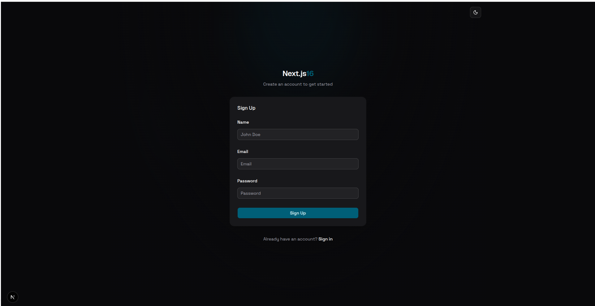
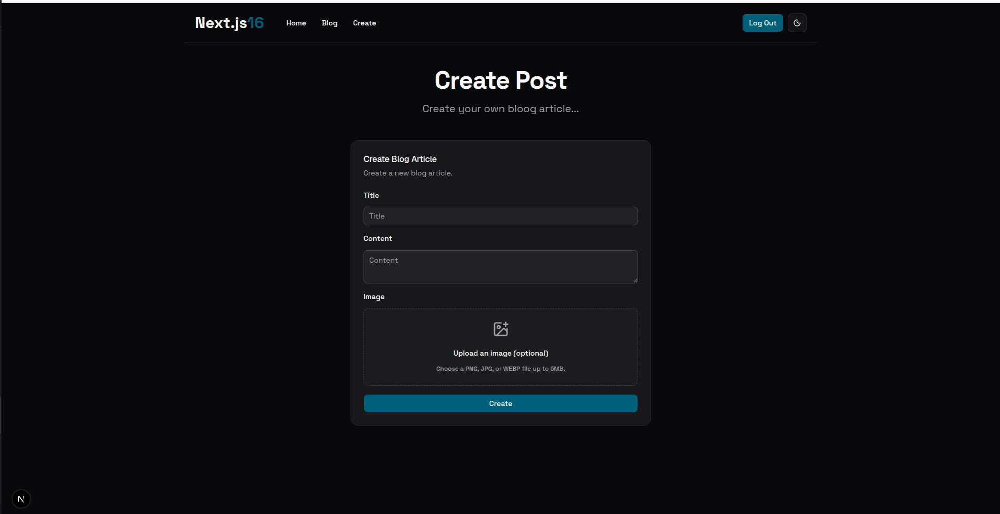
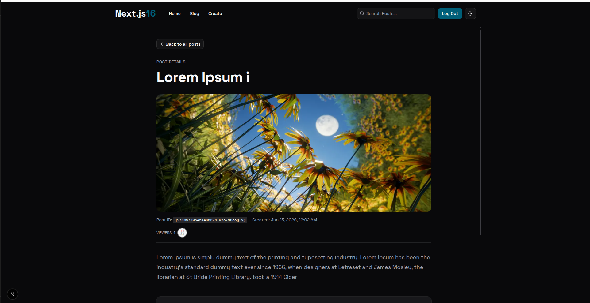

# Next.js 16 — Learning Course

A blog app built with **Next.js 16** — auth, posts with image uploads, comments, search, and real-time presence. Explores App Router, Server Components, and a Convex backend.

> 🎓 **Learning project** — built to deepen understanding of Next.js 16.

## 📸 Screenshots

| Sign Up | Create Post | Post Details |
|---------|-------------|--------------|
|  |  |  |

## 🛠️ Stack

- ⚡ **Next.js 16** · React 19 · App Router
- 🗄️ **Convex** — database, storage, search, real-time
- 🔐 **Better Auth** + `@convex-dev/better-auth`
- 🎨 **Tailwind CSS 4** · shadcn/ui · Radix UI
- 📋 React Hook Form · Zod · Sonner

## 🚀 Getting Started

### 1. Install dependencies

```bash
pnpm install
```

### 2. Set up Convex

Log in and link a Convex project (first run only):

```bash
npx convex dev
```

This syncs backend functions and writes Convex URLs to `.env.local`.

Keep `convex dev` running in a separate terminal while developing.

### 3. Configure environment variables

Create `.env.local` in the project root. After `convex dev`, most values are filled in automatically — add or verify:

```env
# Generated by `convex dev`
CONVEX_DEPLOYMENT=dev:your-deployment-name
NEXT_PUBLIC_CONVEX_URL=https://your-deployment.convex.cloud
NEXT_PUBLIC_CONVEX_SITE_URL=https://your-deployment.convex.site

# Local frontend URL
NEXT_PUBLIC_SITE_URL=http://localhost:3000
```

### 4. Run the app

In a second terminal:

```bash
pnpm run dev
```

Open [http://localhost:3000](http://localhost:3000).
